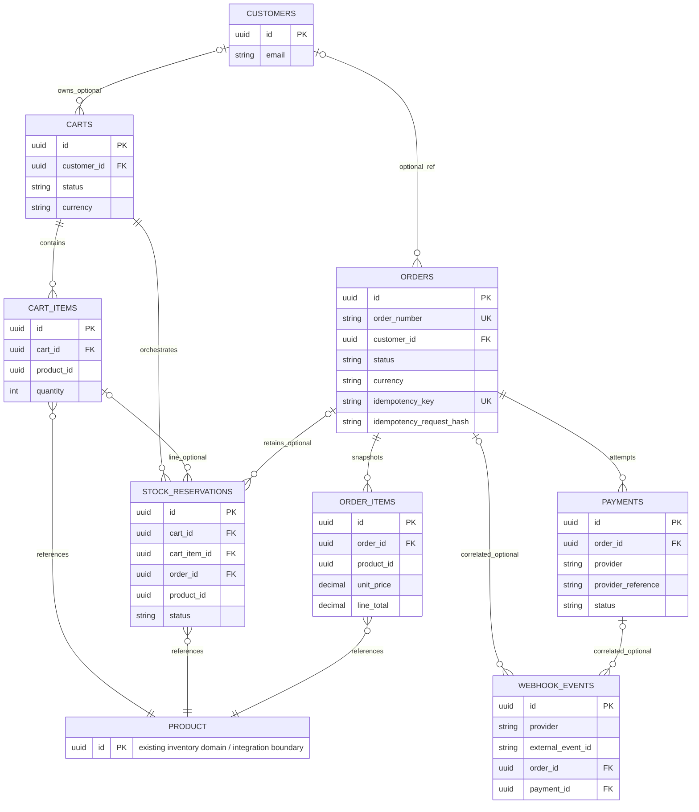

# Project Rotor — Data Model (v0.1)

Documento público de diseño relacional para la **capa transaccional**.
No incluye migraciones ni implementación.

Fuentes de verdad:

- `docs/api/openapi.yaml` (contrato aprobado)
- `docs/ARCHITECTURE.md`
- `README.md`

> This document describes the conceptual relational model of Project Rotor.
> It does not represent private infrastructure, production topology,
> internal hostnames or deployment details.

---

## 1. Scope and inventory boundary

Project Rotor **no** reimplementa en esta fase el núcleo completo de inventario.

El dominio transaccional asume conceptualmente que ya existen:

- productos;
- disponibilidad;
- existencias;
- reservas / movimientos de inventario (efectos definitivos).

Esas capacidades se tratan como:

**existing inventory domain / integration boundary**

Este documento **no** define tablas `products`, `stocks`, `warehouses` ni
`inventory_movements`. En el diagrama ER aparece `PRODUCT` solo como entidad
externa referenciada por UUID (`product_id`).

La capa transaccional se relaciona con ese dominio mediante:

| Momento | Interacción conceptual |
|---------|------------------------|
| Catálogo / carrito | Lectura de disponibilidad y precio vigente |
| Reserva | Solicitud de apartados temporales (`stock_reservations`) |
| Checkout / orden | Revalidación de disponibilidad y reserva vigente |
| PAID | Efecto definitivo de inventario **exactamente una vez** |
| FAILED / EXPIRED / CANCELLED | Liberación de reserva cuando corresponda |

Fórmula de disponibilidad (OpenAPI):

`available_quantity = quantity - reserved_quantity`

---

## 2. Identifier strategy

Todas las entidades **nuevas** de este modelo usan:

```text
id UUID PRIMARY KEY
```

Alineado con OpenAPI (`format: uuid`). No se usan enteros autoincrementales
para entidades transaccionales nuevas.

Las referencias a inventario externo (`product_id`) también son UUID.

---

## 3. Entity overview

| Entidad | Rol |
|---------|-----|
| `customers` | Comprador durable opcional (checkout) |
| `carts` | Intención de compra (ACTIVE + históricos) |
| `cart_items` | Líneas del carrito |
| `stock_reservations` | Orquestación de apartado temporal (no stock físico) |
| `orders` | Orden comercial + snapshot de comprador |
| `order_items` | Snapshot histórico de líneas |
| `payments` | Intentos/resultados de pago sandbox (1 orden → N) |
| `webhook_events` | Ingesta idempotente de eventos del proveedor |

**No** se crea tabla `idempotency_keys` en v0.1 (ver §13 / ADR-DATA-005).

---

## 4. customers

Solo lo necesario para checkout. Datos de ejemplo siempre sintéticos.

### Decisión v0.1: Guest checkout soportado (opción A)

**A. Guest checkout soportado.**

- `orders.customer_id` es **nullable**.
- La sesión/cookie (`cookieAuth` / Sanctum conceptual) identifica el carrito
  temporal y al actor autenticado de la API.
- El comprador de la orden se captura como **snapshot** en `orders`
  (`customer_name`, `customer_email`, …) aunque no exista fila en
  `customers`, o aunque esa fila cambie después.
- `customer_id` es referencia opcional de conveniencia; **nunca** es la
  única fuente de verdad del comprador de una orden.

**No** se elige B (checkout autenticado únicamente con `customer_id`
obligatorio) para v0.1.

#### Tensión contractual (sin modificar OpenAPI)

OpenAPI exige `cookieAuth` en carrito/checkout/órdenes (sesión autenticada),
pero **no** modela un recurso CRUD `Customer` ni distingue explícitamente
“guest buyer” vs “registered customer”. El modelo interno soporta guest
como *identidad de comprador sin fila durable*; el contrato API sigue
basado en sesión + `CustomerData` embebido. Queda como tensión para una
revisión futura del contrato si se desea exponer esa distinción.

### Diccionario

| Campo | Tipo conceptual | Nullable | Restricción | Descripción |
|-------|-----------------|----------|-------------|-------------|
| id | UUID | No | PK | Identificador |
| name | string | No | | Nombre del comprador |
| email | string | No | | Correo |
| phone | string | No | | Teléfono |
| document_type | string | No | | Tipo de documento (código) |
| document_number | string | No | | Número de documento |
| created_at | datetime | No | | Alta |
| updated_at | datetime | No | | Última actualización |

Índices sugeridos: `(email)`, `(document_type, document_number)` — no UNIQUE
obligatorio en v0.1.

---

## 5. carts

| Campo | Tipo conceptual | Nullable | Restricción | Descripción |
|-------|-----------------|----------|-------------|-------------|
| id | UUID | No | PK | Identificador |
| customer_id | UUID | Sí | FK → customers | Dueño cuando exista registro durable |
| status | string enum | No | | Estado del carrito |
| currency | char(3) | No | | ISO-4217 (ej. COP) |
| expires_at | datetime | Sí | | Ventana de carrito/reserva |
| created_at | datetime | No | | Alta |
| updated_at | datetime | No | | Última actualización |

### CartStatus

| Valor | ¿Incluido? | Motivo |
|-------|------------|--------|
| ACTIVE | Sí | Carrito operable |
| CONVERTED | Sí | Convertido a orden |
| EXPIRED | Sí | Caducó por tiempo |
| ABANDONED | Sí | Cerrado sin conversión (analítica/limpieza) |

### Estrategia: como máximo un carrito ACTIVE

Regla de negocio: un cliente (cuando aplica identidad durable / sesión
asociada) debe tener **como máximo un** carrito `ACTIVE`.

**No** se usa `UNIQUE(customer_id, status)`: impediría conservar varios
carritos históricos `EXPIRED`, `CONVERTED` o `ABANDONED` para el mismo
cliente.

En MySQL la unicidad de ACTIVE se resolverá posteriormente mediante una
estrategia explícita, por ejemplo:

- transacción + locking + validación de dominio; **o**
- estrategia técnica equivalente apropiada (p. ej. índice filtrado /
  columna generada si el motor/versión lo permite de forma clara).

**No se implementa todavía.**

La BD sí mantiene un **INDEX** (no UNIQUE) para localizar eficientemente:

```text
INDEX (customer_id, status)
```

`INDEX ≠ UNIQUE`.

---

## 6. cart_items

| Campo | Tipo conceptual | Nullable | Restricción | Descripción |
|-------|-----------------|----------|-------------|-------------|
| id | UUID | No | PK | Identificador de línea |
| cart_id | UUID | No | FK → carts | Carrito dueño |
| product_id | UUID | No | Ref. externa PRODUCT | Producto del dominio inventario |
| quantity | integer | No | CHECK > 0 | Cantidad solicitada |
| created_at | datetime | No | | Alta |
| updated_at | datetime | No | | Última actualización |

### Decisión de precio en carrito

**No** se persisten `unit_price_snapshot` ni `tax_rate_snapshot` en
`cart_items` en v0.1.

Razones:

1. OpenAPI exige snapshot de precio **en la orden**.
2. El carrito muestra precio **actual** recalculado contra catálogo.
3. `PRICE_CHANGED` se detecta en checkout / creación de orden.

Constraint:

```text
UNIQUE (cart_id, product_id)
```

---

## 7. stock_reservations (orquestación)

`stock_reservations` **NO** es la fuente autoritativa del stock físico.

Es un registro **transaccional / orquestador** que relaciona:

- cart;
- cart_item;
- product (`product_id` hacia el dominio externo);
- lifetime de la reserva (`expires_at`, estados);
- order, cuando corresponda;
- estado de la reserva (`ACTIVE` / `CONSUMED` / `RELEASED` / `EXPIRED`).

El **dominio externo de inventario** sigue siendo responsable de validar y
aplicar la disponibilidad real (`available_quantity = quantity - reserved_quantity`
y el efecto definitivo al confirmar pago).

| Campo | Tipo conceptual | Nullable | Restricción | Descripción |
|-------|-----------------|----------|-------------|-------------|
| id | UUID | No | PK | Identificador |
| cart_id | UUID | No | FK → carts | Carrito origen |
| cart_item_id | UUID | Sí | FK → cart_items | Línea asociada |
| order_id | UUID | Sí | FK → orders | Trazabilidad post-conversión |
| product_id | UUID | No | Ref. externa PRODUCT | Producto reservado |
| quantity | integer | No | CHECK > 0 | Unidades apartadas |
| status | string enum | No | | Estado de la reserva |
| expires_at | datetime | No | | Caducidad |
| released_at | datetime | Sí | | Liberación |
| consumed_at | datetime | Sí | | Consumo definitivo |
| created_at | datetime | No | | Alta |
| updated_at | datetime | No | | Última actualización |

**No** se añade `order_item_id`: la correlación producto/cantidad hacia la
orden se obtiene por `order_id` + `product_id` / líneas de orden; no aporta
valor suficiente en v0.1.

### Cuándo se llena `order_id`

Al convertir el carrito en orden (POST `/api/orders` exitoso), las reservas
`ACTIVE` del carrito reciben `order_id` y siguen `ACTIVE` hasta el outcome
de pago. Antes de la conversión, `order_id` permanece `NULL`.

### ReservationStatus

| Estado | Significado |
|--------|-------------|
| ACTIVE | Apartado temporal |
| CONSUMED | Efecto definitivo tras PAID |
| RELEASED | Liberada (cancelación / pago fallido) |
| EXPIRED | Caducó por tiempo |

### Consumo exactamente una vez (ACTIVE → CONSUMED)

La transición `ACTIVE → CONSUMED` debe ocurrir **solo una vez**, aunque:

- lleguen dos webhooks simultáneos;
- reconcile coincida con un webhook;
- exista un retry HTTP del proveedor o del cliente.

Se separan tres capas que cooperan para un **exactly-once business effect**
sobre mensajes externos **at-least-once**:

| Capa | Mecanismo conceptual |
|------|----------------------|
| 1. Idempotencia del evento | `UNIQUE(provider, external_event_id)` en `webhook_events`; duplicado → 200 sin reaplicar efectos |
| 2. Transición de orden | Update condicional `PENDING_PAYMENT → PAID` (solo si el estado actual lo permite) |
| 3. Efecto de inventario / reserva | Update condicional `ACTIVE → CONSUMED` (`WHERE status = 'ACTIVE'`) + llamada única al dominio externo de inventario |

Si la orden ya está `PAID` o la reserva ya está `CONSUMED`, un segundo
camino (webhook duplicado, reconcile, retry) **no** vuelve a consumir.

Jobs de expiración: fuera de alcance de este documento.

---

## 8. orders

| Campo | Tipo conceptual | Nullable | Restricción | Descripción |
|-------|-----------------|----------|-------------|-------------|
| id | UUID | No | PK | Identificador |
| order_number | string | No | UNIQUE | Número público de orden |
| customer_id | UUID | Sí | FK → customers | Referencia opcional (guest OK) |
| status | string enum | No | OrderStatus OpenAPI | Estado actual |
| currency | char(3) | No | ISO-4217 | Moneda de **toda** la orden v0.1 |
| customer_name | string | No | | Snapshot comprador |
| customer_email | string | No | | Snapshot comprador |
| customer_phone | string | No | | Snapshot comprador |
| customer_document_type | string | No | | Snapshot comprador |
| customer_document_number | string | No | | Snapshot comprador |
| delivery_mode | string enum | No | PICKUP \| COORDINATED_SHIPPING | Modalidad |
| subtotal | DECIMAL(18,2) | No | ≥ 0 | Subtotal |
| tax_total | DECIMAL(18,2) | No | ≥ 0 | Impuestos |
| total | DECIMAL(18,2) | No | ≥ 0 | Total |
| idempotency_key | string | No | UNIQUE | Header Idempotency-Key |
| idempotency_request_hash | string | No | | Fingerprint canónico del request |
| paid_at | datetime | Sí | | Momento PAID |
| fulfilled_at | datetime | Sí | | Momento FULFILLED |
| cancelled_at | datetime | Sí | | Momento CANCELLED |
| failed_at | datetime | Sí | | Momento FAILED |
| expired_at | datetime | Sí | | Momento EXPIRED |
| created_at | datetime | No | | Alta |
| updated_at | datetime | No | | Última actualización |

### Money / currency

- Dinero **nunca** `FLOAT` / `DOUBLE`.
- Importes monetarios v0.1: **`DECIMAL(18,2)`**.
- `tax_rate` en líneas: precisión independiente **`DECIMAL(8,4)`**.
- `currency`: código ISO-4217 conceptual (ej. `COP`).
- Todos los ítems / pagos de una orden usan la moneda definida por la orden
  en v0.1 (sin multi-currency por línea).

### Timestamps de estado

`paid_at`, `fulfilled_at`, `cancelled_at`, `failed_at`, `expired_at` son
auditoría; la fuente del estado vigente es `status`.

La vigencia de reserva se consulta en `stock_reservations` (no se duplica
`reservation_expires_at` en `orders`).

---

## 9. order_items

Snapshot histórico **inmutable** a nivel de negocio.

| Campo | Tipo conceptual | Nullable | Restricción | Descripción |
|-------|-----------------|----------|-------------|-------------|
| id | UUID | No | PK | Identificador |
| order_id | UUID | No | FK → orders | Orden dueña |
| product_id | UUID | No | Ref. externa PRODUCT | Correlación de catálogo |
| sku | string | No | | Snapshot SKU |
| product_name | string | No | | Snapshot nombre |
| quantity | integer | No | CHECK > 0 | Cantidad comprada |
| unit_price | DECIMAL(18,2) | No | ≥ 0 | Precio unitario fijado |
| tax_rate | DECIMAL(8,4) | Sí | ≥ 0 | Tasa aplicada |
| tax_amount | DECIMAL(18,2) | No | ≥ 0 | Impuesto de línea |
| line_subtotal | DECIMAL(18,2) | No | ≥ 0 | Subtotal de línea |
| line_total | DECIMAL(18,2) | No | ≥ 0 | Total de línea |
| created_at | datetime | No | | Alta |
| updated_at | datetime | No | | No debe mutar montos/sku/nombre |

Moneda implícita = `orders.currency`. Una modificación posterior del
producto **no** altera `order_items`.

---

## 10 — payments

Relación: **ORDER 1 → N PAYMENTS** (múltiples intentos sandbox).

| Campo | Tipo conceptual | Nullable | Restricción | Descripción |
|-------|-----------------|----------|-------------|-------------|
| id | UUID | No | PK | Identificador (= payment_id API) |
| order_id | UUID | No | FK → orders | Orden asociada |
| provider | string enum | No | PaymentProvider OpenAPI | Proveedor sandbox |
| provider_reference | string | Sí | UNIQUE(provider, provider_reference) cuando no NULL | Referencia externa |
| status | string enum | No | PaymentStatus OpenAPI | Estado normalizado |
| amount | DECIMAL(18,2) | No | ≥ 0 | Monto (misma moneda de la orden) |
| currency | char(3) | No | = orders.currency v0.1 | Moneda |
| redirect_url | string | Sí | | URL UX (no confirma pago) |
| expires_at | datetime | Sí | | Expiración del intent |
| paid_at | datetime | Sí | | Aprobación |
| failed_at | datetime | Sí | | Fallo/declinación |
| created_at | datetime | No | | Alta |
| updated_at | datetime | No | | Última actualización |

### `provider_reference` nullable

Puede ser `NULL` **antes** de contactar al proveedor (registro local del
intent). Tras obtener la referencia sandbox, se persiste.

Estrategia UNIQUE preferida cuando la referencia existe:

```text
UNIQUE (provider, provider_reference)
```

En MySQL, múltiples `NULL` en columnas UNIQUE suelen permitirse; el dominio
debe evitar dos filas “pendientes de referencia” ambiguas para el mismo
intento lógico si aplica.

### Valores EXACTOS desde OpenAPI

**PaymentProvider:** `WOMPI` | `MERCADOPAGO`

**PaymentStatus:** `PENDING` | `APPROVED` | `DECLINED` | `EXPIRED` | `CANCELLED` | `ERROR`

### Prohibido almacenar

- PAN completo;
- CVV;
- secretos / claves privadas / API keys;
- tokens sensibles del instrumento de pago;
- firmas crudas innecesarias.

---

## 11. webhook_events

| Campo | Tipo conceptual | Nullable | Restricción | Descripción |
|-------|-----------------|----------|-------------|-------------|
| id | UUID | No | PK | Identificador interno |
| provider | string enum | No | PaymentProvider | Proveedor origen |
| external_event_id | string | No | UNIQUE con provider | = X-Webhook-Id / event_id |
| event_type | string | Sí | | Tipo conceptual |
| signature_verified | boolean | No | | Firma validada antes de efectos |
| payload | JSON | Sí | | Payload sanitizado |
| received_at | datetime | No | | Recepción |
| processed_at | datetime | Sí | | Fin de procesamiento |
| processing_status | string enum | No | | RECEIVED / PROCESSED / IGNORED_DUPLICATE / FAILED |
| processing_result | string | Sí | | Resumen interno (p. ej. DUPLICATE_WEBHOOK_EVENT) |
| order_id | UUID | Sí | FK → orders | Correlación de orden |
| payment_id | UUID | Sí | FK → payments | Correlación de pago |
| created_at | datetime | No | | Alta |
| updated_at | datetime | No | | Última actualización |

### Correlación nullable

El evento puede recibirse **antes** de resolver toda la correlación.
`order_id` y `payment_id` son **nullable** y se rellenan cuando el
procesamiento identifica la orden/pago. Eventos inválidos/desconocidos
pueden conservarse para auditoría **sin** exigir `payment_id`.

### Constraint crítico

```text
UNIQUE (provider, external_event_id)
```

Reintentos del proveedor → HTTP 200 idempotente; sin segundo efecto de
negocio.

---

## 12. Order status machine (storage vs domain)

### OrderStatus EXACTO (OpenAPI)

`DRAFT` | `PENDING_PAYMENT` | `PAID` | `FULFILLED` | `FAILED` | `EXPIRED` | `CANCELLED`

### Transiciones permitidas

```text
DRAFT → PENDING_PAYMENT
DRAFT → CANCELLED

PENDING_PAYMENT → PAID
PENDING_PAYMENT → FAILED
PENDING_PAYMENT → EXPIRED
PENDING_PAYMENT → CANCELLED

PAID → FULFILLED
```

La BD almacena el estado actual; las reglas de transición son de dominio.
No se implementan con triggers SQL.

---

## 13. Idempotency strategy (order creation) — v0.1

### Decisión

Mantener **`orders.idempotency_key UNIQUE`** (sin tabla genérica).

Añadir **`idempotency_request_hash`**: fingerprint de la representación
canónica de los campos relevantes del request (p. ej. customer + delivery +
identidad estable del carrito / líneas materializadas al crear).

No se fija aquí un algoritmo criptográfico concreto.

| Caso | Comportamiento |
|------|----------------|
| A. Misma `Idempotency-Key` + misma solicitud (mismo hash) | Devolver / reutilizar la misma orden |
| B. Misma `Idempotency-Key` + payload materialmente distinto (hash distinto) | `IDEMPOTENCY_CONFLICT` (HTTP 409) |

Concurrencia: el UNIQUE sobre `idempotency_key` serializa el primer insert;
el perdedor relee y compara hash.

---

## 14. Concurrency and integrity (design intent)

| Escenario | Protección conceptual |
|-----------|------------------------|
| Dos usuarios reservan la última unidad | Dominio inventario + reservas orquestadas; update condicional |
| Un solo carrito ACTIVE | Transacción + locking + validación de dominio (no UNIQUE compuesto status) |
| Dos requests mismo Idempotency-Key | `UNIQUE(idempotency_key)` + comparación de `idempotency_request_hash` |
| Dos webhooks idénticos | `UNIQUE(provider, external_event_id)` → 200 sin reaplicar |
| Webhook + reconcile concurrentes | Capas evento / transición orden / consumo reserva (exactly-once de negocio) |
| Redirect del navegador | Nunca confirma PAID ni consume inventario |

---

## 15. Indexes and UNIQUE constraints (definitive)

### UNIQUE (y el índice que implican — no duplicar INDEX aparte)

| Constraint | Tabla |
|------------|-------|
| `PRIMARY KEY (id)` | todas las entidades nuevas |
| `UNIQUE (cart_id, product_id)` | `cart_items` |
| `UNIQUE (order_number)` | `orders` |
| `UNIQUE (idempotency_key)` | `orders` |
| `UNIQUE (provider, provider_reference)` | `payments` (cuando reference no NULL / política motor) |
| `UNIQUE (provider, external_event_id)` | `webhook_events` |

### INDEX no únicos

| Índice | Justificación |
|--------|---------------|
| `carts(customer_id, status)` | Localizar ACTIVE / historial — **NO UNIQUE** |
| `cart_items(cart_id)` | Cargar líneas (además del UNIQUE compuesto) |
| `stock_reservations(product_id, status, expires_at)` | Orquestación / expiración |
| `stock_reservations(order_id)` | Reservas de una orden |
| `orders(customer_id, created_at)` | Historial |
| `orders(status, created_at)` | Operación |
| `payments(order_id)` | Intentos de una orden |
| `webhook_events(order_id)` | Auditoría por orden |
| `webhook_events(payment_id)` | Auditoría por pago |
| `webhook_events(processing_status, received_at)` | Operación / reproceso |

**Prohibido:** `UNIQUE(customer_id, status)` en `carts`.

No listar de nuevo como INDEX simple las columnas ya cubiertas por UNIQUE.

---

## 16. Deletion and audit

Para `orders`, `order_items`, `payments`, `webhook_events`:

- **No hard delete** durante operación normal.
- **No soft delete** (`deleted_at`) como mecanismo normal del flujo.
- Ciclo de vida = **estados + timestamps + auditoría**.
- Una cancelación o fallo **no** se representa borrando la fila histórica:
  se usa `CANCELLED` / `FAILED` / etc.

`carts` / reservas temporales usan estados `EXPIRED` / `ABANDONED` /
`RELEASED` / `CONSUMED` sin pretender borrar el rastro operativo útil.

---

## 17. Entity-relationship diagram



Cardinalidades:

- `CUSTOMERS o|--o{ CARTS` — un CART puede tener 0 o 1 CUSTOMER (`carts.customer_id` nullable / guest); un CUSTOMER puede tener 0 o muchos CARTS.
- `CUSTOMERS o|--o{ ORDERS` — una ORDER puede tener 0 o 1 CUSTOMER durable (`orders.customer_id` nullable / guest); un CUSTOMER puede tener 0 o muchas ORDERS; el **snapshot** del comprador en `orders` sigue siendo obligatorio.
- `CART_ITEMS o|--o{ STOCK_RESERVATIONS` — una STOCK_RESERVATION puede relacionarse con 0 o 1 CART_ITEM (`cart_item_id` nullable); un CART_ITEM puede tener 0 o muchas STOCK_RESERVATIONS históricas (p. ej. ACTIVE→EXPIRED y luego una nueva ACTIVE). **No** existe `UNIQUE(cart_item_id)`.
- `CARTS ||--o{ CART_ITEMS` / `CARTS ||--o{ STOCK_RESERVATIONS` — un carrito contiene sus líneas y orquesta sus reservas.
- `ORDERS ||--o{ ORDER_ITEMS` / `ORDERS ||--o{ PAYMENTS` — una orden, muchos ítems e intentos de pago.
- `ORDERS o|--o{ STOCK_RESERVATIONS` — `order_id` nullable hasta la conversión del carrito.
- `ORDERS o|--o{ WEBHOOK_EVENTS` / `PAYMENTS o|--o{ WEBHOOK_EVENTS` — `order_id` / `payment_id` nullable hasta resolver correlación.
- `PRODUCT` externo (integration boundary).

---

## 18. Consistency check vs OpenAPI

| Tema | OpenAPI | Modelo | ¿Alineado? |
|------|---------|--------|------------|
| UUID | `format: uuid` | PK UUID | Sí |
| OrderStatus | DRAFT…CANCELLED | Igual | Sí |
| PaymentStatus | PENDING…ERROR | Igual | Sí |
| PaymentProvider | WOMPI, MERCADOPAGO | Igual | Sí |
| Idempotency-Key | header obligatorio | `idempotency_key` + hash | Sí |
| Customer snapshot | CustomerData en Order | columnas snapshot | Sí |
| Order items snapshot | sku, name, prices | `order_items` | Sí |
| Payment attempts | payment-intent por orden | 1→N `payments` | Sí |
| Webhook ids | X-Webhook-Id / event_id | `external_event_id` UNIQUE | Sí |
| reservation_expires_at | en Cart/CartItem API | `stock_reservations.expires_at` / `carts.expires_at` | Sí |
| Cookie auth cart | cookieAuth requerido | sesión identifica carrito; guest = comprador sin fila durable | Sí con tensión anotada |

### Tensiones (OpenAPI no modificado)

1. Precios de carrito en API vs no persistidos en `cart_items`.
2. Guest buyer interno vs ausencia de recurso Customer en OpenAPI.
3. `idempotency_request_hash` es detalle de persistencia no expuesto en OpenAPI
   (compatible; el conflicto se expresa como `IDEMPOTENCY_CONFLICT`).
4. `payment_id` / `order_id` en webhooks son auditoría interna.

---

## 19. Architecture Decisions

### ADR-DATA-001 UUID

- **Context:** OpenAPI usa UUID.
- **Decision:** PK UUID en entidades transaccionales nuevas.
- **Consequence:** Sin serial integers.

### ADR-DATA-002 Money as decimal, never float

- **Context:** Totales comerciales sensibles a redondeo.
- **Decision:** `DECIMAL(18,2)`; `tax_rate` `DECIMAL(8,4)`; currency ISO-4217
  única por orden en v0.1.
- **Consequence:** API puede serializar string; BD nunca FLOAT.

### ADR-DATA-003 Order items are immutable snapshots

- **Context:** Precio de orden independiente del catálogo posterior.
- **Decision:** Snapshot en `order_items`.
- **Consequence:** Auditoría estable.

### ADR-DATA-004 Webhook uniqueness by provider + external_event_id

- **Context:** Entregas at-least-once.
- **Decision:** UNIQUE + correlación nullable `order_id` / `payment_id`.
- **Consequence:** Exactly-once de negocio con 200 en duplicados.

### ADR-DATA-005 Order creation idempotency strategy

- **Context:** Header Idempotency-Key.
- **Decision:** `idempotency_key UNIQUE` + `idempotency_request_hash`.
- **Consequence:** Caso A reutiliza; caso B → IDEMPOTENCY_CONFLICT.

### ADR-DATA-006 Inventory remains an integration boundary

- **Context:** No ERP completo en esta fase.
- **Decision:** `stock_reservations` orquesta; inventario externo valida/aplica.
- **Consequence:** Sin tablas product/stock/warehouse aquí.

### ADR-DATA-007 No card/payment secrets stored

- **Context:** Alcance público / sandbox.
- **Decision:** Sin PAN, CVV, secretos, claves, tokens de instrumento.
- **Consequence:** Menor superficie de fuga.

### ADR-DATA-008 Single ACTIVE cart without UNIQUE(status)

- **Context:** Históricos EXPIRED/CONVERTED/ABANDONED deben coexistir.
- **Decision:** Regla de dominio + locking; INDEX `(customer_id, status)` no UNIQUE.
- **Consequence:** MySQL enforcement explícito en implementación futura.

### ADR-DATA-009 Guest checkout (v0.1 option A)

- **Context:** Checkout con CustomerData; sesión cookieAuth.
- **Decision:** Guest soportado; `customer_id` nullable; snapshot en orden.
- **Consequence:** Tensión menor con OpenAPI (sin CRUD Customer).

---

## 20. Out of scope for this document

- Migraciones Laravel / SQL ejecutables
- Jobs de expiración de reservas
- RBAC fino de conciliación
- Modelo completo de inventario
- Implementación concreta de locking / hash canónico
